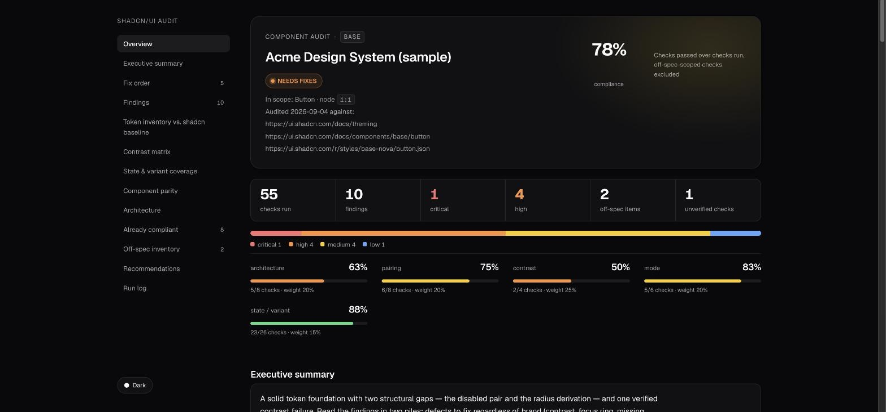
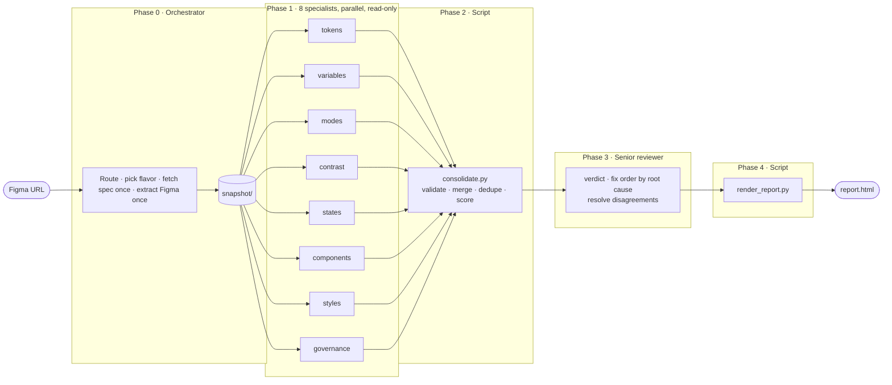

<div align="center">

# shadcn/ui Figma Audit Swarm

**Paste a Figma URL. Get a senior-level audit of how closely it matches shadcn/ui — with evidence for every finding.**

[](dist/shadcn-figma-audit-swarm.skill)
[](CHANGELOG.md)
[](https://ui.shadcn.com/docs)
[](#-choose-the-flavor)
[](scripts/selftest.sh)
[](NOTICE)

[**Overview**](docs/overview.md) · [**Resumen en español**](docs/overview.es.md) · [**Sample report**](examples/sample-report.html) · [**Changelog**](CHANGELOG.md)

<br>



<sub>Rendered from synthetic data — see <code>scripts/make_fixture.py</code></sub>

</div>

<br>

## Why this exists

Design-to-dev handoff breaks on the things nobody notices by hand: a button 44 px tall where the code says 32, a focus ring bound to a grey that isn't `ring`, a `secondary-foreground` token that exists but nothing uses, a dark mode faked in a variable's *name*. Finding these across 130 component sets takes days and depends on who is looking.

The swarm does it in about fifteen minutes per component, the same way every time, against the spec **as it is today** — not as anyone remembers it.

<br>

## How it works



**Extract once.** The orchestrator identifies what the URL is (file, page, component set, single variant), fetches today's shadcn docs *and* the component's `cva` source from the shadcn registry, and pulls Figma data through the Figma MCP connector — variables with light/dark values and alias chains, styles, component properties, and a sample of variants with measured padding, heights, fonts and bound tokens. Nothing downstream touches Figma or the web again, so all eight specialists reason from identical data.

**Eight specialists, one concern each.** Every specialist writes findings in one shared contract ([`references/findings-schema.md`](references/findings-schema.md)). A finding without evidence from the snapshot *and* a citation into the shadcn docs is rejected.

**Scored by code, not opinion.** `consolidate.py` merges duplicates (eight agents describing the same focus ring become one finding credited to all eight), flags disagreements, and computes the score. Two runs on the same file give the same number.

**Reviewed, not rubber-stamped.** The reviewer resolves disagreements, groups fixes by root cause, and separates real defects from deliberate brand choices. It can lower a severity with a stated reason. It cannot add findings or raise severities — evidence outranks judgment.

<br>

## What each specialist checks

| Specialist | Owns | Typical finding |
|---|---|---|
| **tokens** | Baseline token set, surface/foreground pairing, radius scale, semantic roles | `primary-disabled` has no `-foreground` pair |
| **variables** | Tier architecture (primitive → semantic → component), aliases, orphans, scopes | Semantic variable holds raw hex instead of an alias |
| **modes** | Light/Dark coverage, deliberate dark values, mode mechanism | `accent-hover` identical in both modes |
| **contrast** | WCAG 2.1 ratios per pair per mode, alpha composited over real backdrop | Focus ring 1.50:1 vs background |
| **states** | Variant × state matrix, one state convention, focus/disabled rendering | Ghost variant has no `focus-visible` state |
| **components** | 1:1 API parity: names, variants, sizes, measured px vs Tailwind classes, anatomy, props | `size=default` is 44 px; spec `h-8` is 32 |
| **styles** | Text/effect styles vs Tailwind classes, styles duplicating variables | Label style is weight 600; spec `font-medium` is 500 |
| **governance** | Descriptions, doc links, hidden layers, sibling drift, Code Connect readiness | Property `Variant` should be `variant` for a clean mapping |

<br>

## Scoring

<table>
<tr><td>

**Component audit** → compliance %

```
checks passed / checks run
```

Checks on off-spec variants are excluded (`off_spec_scope`), so a parity number never moves because of something shadcn doesn't define.

</td><td>

**System audit** → health score / 100

| Dimension | Weight |
|---|---|
| Contrast | 25 |
| Pairing | 20 |
| Mode parity | 20 |
| Architecture | 20 |
| State / variant | 15 |
| Governance | reported, unweighted |

</td></tr>
</table>

### Verdicts

| Verdict | Meaning |
|---|---|
| 🟢 **READY FOR HANDOFF** | No critical or high findings, compliance ≥ 90 % |
| 🟠 **NEEDS FIXES** | The normal case — work the fix order |
| 🔴 **BLOCKED (off-spec)** | The API surface has variants or properties shadcn doesn't define and nobody has documented them as intentional. The report states the cheapest unblock — usually one line in the component description. |

<br>

## Install

<details open>
<summary><b>Cowork / Claude desktop</b></summary>

Drop [`dist/shadcn-figma-audit-swarm.skill`](dist/shadcn-figma-audit-swarm.skill) into a Claude conversation and click **Save skill**.

</details>

<details>
<summary><b>Claude Code</b></summary>

```bash
git clone https://github.com/lsanchez-g2/shadcnui-auditor \
  ~/.claude/skills/shadcn-figma-audit-swarm
```

</details>

**Requirements:** the Figma MCP connector (`get_metadata`, `get_design_context`, `get_variable_defs`, `search_design_system`, `get_screenshot`, and read-only `use_figma`), web fetch for `ui.shadcn.com`, subagents (the Agent tool), Python 3 for the scripts.

<br>

## Use

Share a Figma URL and ask for an audit.

```
Audit this against shadcn/ui: https://www.figma.com/design/<file>/<name>?node-id=12-34
```

| URL points at | Mode |
|---|---|
| A component set | Component audit |
| A single variant, or a page with one set | Component audit on its set |
| A page with many sets, or no `node-id` | System audit |

### Choose the flavor

shadcn ships three primitive flavors with **different APIs**. Say which one engineering uses:

- **Base UI** — current default; un-prefixed docs URLs redirect here
- **Radix UI**
- **React Aria**

The skill infers the flavor from the file when it can (e.g. `icon-xs` exists only in Base UI's Button) and states the assumption in the report header.

### Variable structure

The skill reads collections, modes, alias chains and scopes itself through a **read-only** `use_figma` script. If the file is view-only, it asks for screenshots of the Variables panel and transcribes them into `snapshot/ground_truth.md`. Variable *names* are never treated as evidence about mode cells.

<br>

## The report

<details>
<summary><b>What's inside</b></summary>

- Verdict, score, and the cheapest unblock when blocked
- KPI strip (checks · findings · critical · high · off-spec · unverified) and severity distribution
- Per-dimension progress bars with weights
- Executive summary and top issues
- **Fix order** grouped by root cause, with effort and linked finding IDs
- **Findings** — filter by severity or agent, search any field; each expands to current → expected value, exact fix (copy button), benefit, evidence, docs link
- Token inventory vs. baseline · contrast matrix with colour-pair swatches · state × variant coverage · component parity · alias chains · mode parity · styles
- Already-compliant list (so nothing gets "fixed" that isn't broken)
- Off-spec inventory, unverified checks, specialist disagreements and how the reviewer resolved them
- Recommendations, reviewer demotions, run log

Self-contained HTML. Light/dark with three-state theme handling. Sortable tables. Print stylesheet. Respects `prefers-reduced-motion`. Set in Geist and Geist Mono — the faces shadcn's own docs use.

</details>

<br>

## Rules the skill will not break

> **Never audit from memory.** The spec is fetched every run. shadcn's own defaults have changed materially — radius scale, Button sizes, Base UI as default — and a score against a remembered spec is a wrong score.

> **Never guess a value you could read.** Anything unverifiable is labelled `unverified`, not scored.

> **Don't invent, don't remove, don't add.** What shadcn doesn't define is listed as off-spec, never folded into the score.

> **Write the fix for the person executing it.** Exact variable, exact value, exact scope, exact layer.

<br>

## Evidence & confidence states

The rules above are enforced, not just stated — `consolidate.py` rejects a specialist's output that doesn't carry the right evidence field for the claim it's making. This is what each one means and when it applies.

| Field | Values | When it's required | What it stops |
|---|---|---|---|
| `confidence` | `verified` · `inferred` · `unverified` | every finding | `verified` means the specific instance the finding is about was directly observed. `inferred` means it was extrapolated from a sampled instance to unsampled ones — the file may have 240 variants and only 24 were individually inspected; a pattern seen in the sample is `inferred`, not `verified`, and is never phrased as "all variants". `unverified` means there isn't enough evidence either way. A `critical` finding that is `inferred` or `unverified` is demoted to `high` automatically. |
| `evidence_scope` | `component` · `global` · `not_applicable` | any finding phrased as a missing/absent **token** claim (tokens/variables categories) | A component-scoped snapshot (one node's bound variables) proves only that *this component* doesn't reference a token — never that the token doesn't exist anywhere in the library. `global` means a library-wide source was checked (a full variable pull, `search_design_system`, `ground_truth.md`); without one, the claim goes in `unverified[]`, not `findings[]`. Doesn't apply to a component's own variant/size *values* — those are fully visible from that component's own metadata, no wider search needed. |
| `alias_status` | `aliased_verified` · `aliased_target_unknown` · `not_aliased_verified` · `unknown` | every `category: alias` finding | `get_variable_defs`/`variables.json` returns a flat name→resolved-value map with **no alias chain data** — a raw-looking hex could be a literal or the resolved end of an alias the tool didn't show. Only `use_figma` or `ground_truth.md` (which do expose chains) can support `not_aliased_verified`; otherwise it's `aliased_target_unknown`. |
| `mode_evidence` | `cell_values` · `name_inference` · `not_applicable` | every `category: mode` finding | A variable named `dark:destructive` or similar tells you nothing about what its actual Dark cell holds — real files have had both cells correctly populated despite a `dark:`-shaped name. `name_inference` is rejected outright; a mode claim needs `cell_values` (from `ground_truth.md` or a mode-aware pull) or it isn't a finding. |
| `sample_scope` | `exhaustive` · `sampled` | required alongside `confidence: inferred` | Names what was actually inspected, so the report can show its work instead of a bare "inferred". |
| `divergence_status` | `none` · `candidate` · `accepted` | reviewer-only, never set by a specialist | shadcn is the audit's reference baseline, not the file's absolute truth. A real, verified, system-wide deviation on an axis shadcn *does* define (unlike `off_spec_scope`, for axes it doesn't define at all) can be `accepted` by the reviewer as a deliberate design-system decision — under strict criteria (consistent across every sampled instance, a documented or otherwise-signaled decision, costly to normalize) — rather than scored as a plain defect. `report.html` shows both the raw and the accepted-divergence-adjusted compliance number side by side; accepting one never silently changes "the" score. |

Specialists never resolve their own uncertainty by picking the more severe reading — an unresolved case is `unverified`, full stop, and the report says so.

<br>

## Repository

```
SKILL.md                     orchestrator instructions — what Claude follows
agents/                      one prompt per specialist · _common.md · reviewer.md
references/
  shadcn-baseline.md         token contract, radius scale, roles, flavor differences
  extraction.md              Figma MCP → snapshot mapping, sampling, lessons from real runs
  findings-schema.md         the JSON contract every agent writes · scoring rules
scripts/
  consolidate.py             validate · merge · dedupe · score → merged.json
  render_report.py           merged.json + review.json → report.html + accepted-divergence-adjusted score
  _scoring.py                shared scoring formula (consolidate.py's raw score, render_report.py's adjusted score)
  contrast.py                WCAG 2.1 with oklch parsing and alpha compositing
  make_fixture.py            synthetic audit workspace — no client data
  selftest.sh                deterministic pipeline, end to end (runs tests/ first)
tests/test_regression.py    evidence/confidence-state regression tests (stdlib unittest, no deps)
assets/report_template.html
docs/                        overview EN · ES · origin prompt
examples/sample-report.html  rendered from the fixture
dist/                        packaged .skill
```

<br>

## Develop

```bash
scripts/selftest.sh
```

Runs `tests/test_regression.py`, generates a fixture, consolidates, renders, and checks `contrast.py` against the 4.54:1 boundary case. Run just the regression tests with `python3 tests/test_regression.py -v` or `python3 -m unittest discover -s tests -v`.

Audit workspaces (`audits/`, `snapshot/`, `findings/`, `merged.json`, `review.json`) are git-ignored — they hold a client's design data. Test with the fixture or with your own file.

When a real run teaches something, put it in the skill, not the conversation:

| Lesson about… | Goes in |
|---|---|
| A Figma MCP quirk | `references/extraction.md` |
| A spec change | `references/shadcn-baseline.md` |
| A judgment rule | the agent that owns the concern |
| A merge or scoring rule | `scripts/consolidate.py` + `references/findings-schema.md` |

<br>

## Known limits

Large sets are sampled by axis, not inspected variant by variant; unsampled variants are marked. Publish status isn't exposed by the Figma connector. A nested component set referenced inside the audited one needs its own URL. The reviewer's split between "brand choice" and "defect" is a judgment — the report shows the reasoning so you can overrule it.

<br>

## License

Internal G2 tooling — **Copyright © 2026 G2.com, Inc. All rights reserved.** See [`NOTICE`](NOTICE). Not for use or distribution outside G2 without written permission; ask the repository owner before sharing externally or proposing an open-source release.
